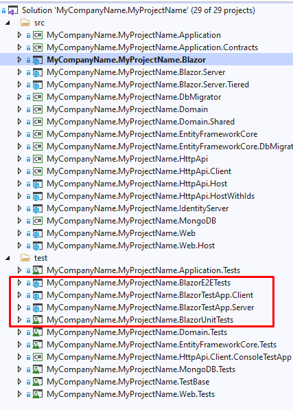

## Running E2E and unit tests

Hi, in this post we will learn how to run Blazor unit test with ABP framework.

Before we start we need to cover some fundamentals. In our project we have two ways of testing our Blazor components.

- Unit tests
- Integration (E2E) tests



### Unit tests

Unit tests are backed by the very good open-source library [bUnit](https://bunit.dev/). They are the easiest and fastest way of running the tests.

### Integration test

Integration tests are backed by the [Selenium](https://www.selenium.dev/) framework. While they are indeed slower than bUnit tests, they are used when you want to make sure that your tests are working as expected in real world scenarios.

---

> Both test solutions have their own pros and cons. With bUnit based tests you gain the speed but you don't get the access to JSRuntime, meaning you will need to mock any call to JavaScript. With Selenium based tests you get slower tests but in turn you get all the features that any browser will have. Including the access to JSRuntime and JavaScript functions.

It is entirely up to you how they will be used, based on your project specifics. We will provide you the tools.

## Installation

bUnit should be automatically installed as a NuGet package, but with Selenium it is a little different situation. You will need to manually install Selenium drivers before we try running the tests.

Go and get [selenium-standalone](https://www.npmjs.com/package/selenium-standalone#install--run) by globally installing it with NPM

```bash
npm install selenium-standalone -g
selenium-standalone install && selenium-standalone start
```

> Don't forget to run selenium before you need to run test(if already not running). The CLI command to start selenium is: `selenium-standalone start`

At this point you should be safe to run tests in Visual Studio. So, open your project and click on `Run All Tests` in Test Explorer.

## Creating new test

### Setup

Expand `MyCompanyName.MyProjectName.BlazorTestApp.Client` and add new `Razor Component` file, named `AlertComponent.razor`.

Copy the following into newly create file:

```html
<Button ElementId="btn_show_alert" Clicked="@(()=>alertVisible = true)">
    Show alert
</Button>

<Alert ElementId="alert_test" @bind-Visible="@alertVisible" Color="Color.Success">
    <AlertMessage>
        This is a simple alert message!
    </AlertMessage>
</Alert>

@code{
    bool alertVisible = false;
}
```

Open `Index.razor` and add new option under the `select` element:

```html
<option value="MyCompanyName.MyProjectName.BlazorTestApp.Client.AlertComponent">AlertComponent</option>
```

> Your project might have a different namespaces so don't forget to adjust them.

Now you can try and see your test in actions to make sure we have done it right. Run project `MyCompanyName.MyProjectName.BlazorTestApp.Server` and once opened select `AlertComponent` from the option dropdown. Click on the "Show alert" button. Alert message should appear.

> Don't be afraid if test doesn't look pretty. We test the functionality, not the form :)

### Unit Testing

OK, let's start with unit testing. Open project `MyCompanyName.MyProjectName.BlazorUnitTests` and under folder `Components` create new class `AlertComponentTest.cs`.

Copy the following:

```cs
public class AlertComponentTest : TestContext
{
    public AlertComponentTest()
    {
        AbpTestConfig.Setup(Services);
    }

    [Fact]
    public void CanOpenAlert()
    {
        // setup
        var comp = RenderComponent<AlertComponent>();
        var button = comp.Find("#btn_show_alert");
        var alert = comp.Find("div.alert");

        // first test that alert is hidden
        var result1 = alert.ClassName;
        Assert.Equal("alert alert-success d-none", result1);

        // trigger button click
        button.Click();

        // test that alert is not hidden
        var result2 = alert.ClassName;
        Assert.Equal("alert alert-success", result2);
    }
}
```

Open `Test Explorer`, and `Run All Tests` or right click on `AlertComponentTest` and `Run`.

> The test should pass at this point. If it fails please make sure you have followed all the steps so far.

Congratulate! Your first unit test is now finished. We can now proceed with integration test.

### Integration Testing

Select `MyCompanyName.MyProjectName.BlazorE2ETests` project and add same as before add `AlertComponentTest.cs` file.

Copy the following code:

```cs
using MyCompanyName.MyProjectName.BlazorE2ETests.Infrastructure;
using MyCompanyName.MyProjectName.BlazorE2ETests.Infrastructure.ServerFixtures;
using MyCompanyName.MyProjectName.BlazorTestApp.Client;
using OpenQA.Selenium;
using Xunit;
using Xunit.Abstractions;
using DevHostServerProgram = MyCompanyName.MyProjectName.BlazorTestApp.Server.Program;

public class AlertComponentTest : BasicTestAppTestBase
{
    public AlertComponentTest(BrowserFixture browserFixture,
        ToggleExecutionModeServerFixture<DevHostServerProgram> serverFixture,
        ITestOutputHelper output)
        : base(browserFixture, serverFixture, output)
    {
        Navigate(ServerPathBase, noReload: !serverFixture.UsingAspNetHost);
        MountTestComponent<AlertComponent>();
    }

    [Fact]
    public void CanOpenAlert()
    {
        var button = Browser.FindElement(By.Id("btn_show_alert"));

        // first test that alert is hidden
        var alert = Browser.FindElement(By.CssSelector(".alert.alert-success.d-none"));
        WaitAssert.NotNull(() => alert);

        button.Click();

        // test that alert is not hidden
        alert = Browser.FindElement(By.CssSelector(".alert.alert-success"));
        WaitAssert.NotNull(() => alert);
    }
}
```

Open `Test Explorer`, and `Run All Tests` or right click on `AlertComponentTest` and `Run`.

Integration tests should be little slower but you should be able to make them run successfully by now.

## Wrap up

Blazor unit testing can at times be slow and tedious at times but they are necessary to make sure your project is running as expected at all times. Every testing technology is a tool, so chose your testing based on the specific scenario.

With that we can conclude our guide. Good luck with testing and see you next time 😉!